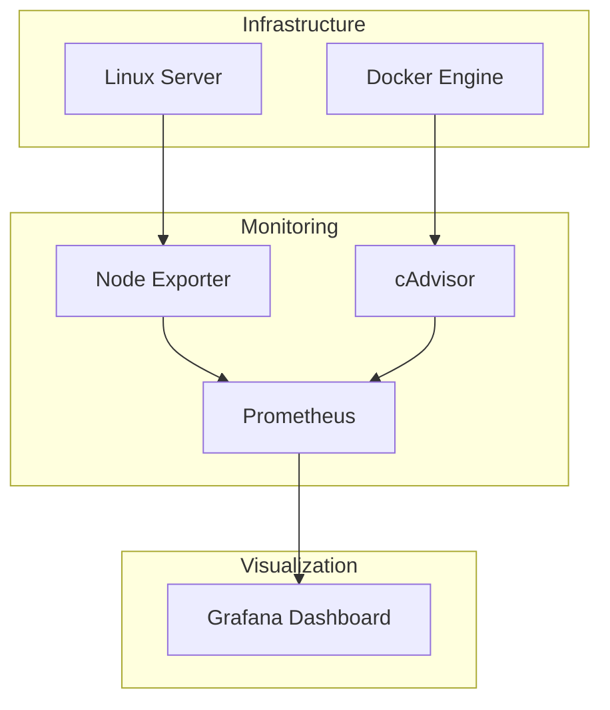
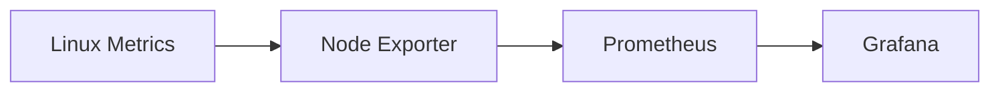
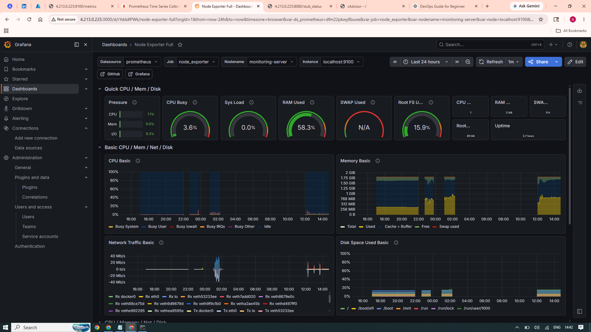
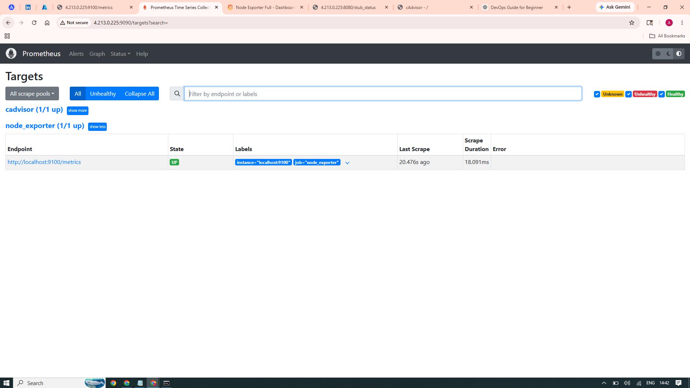
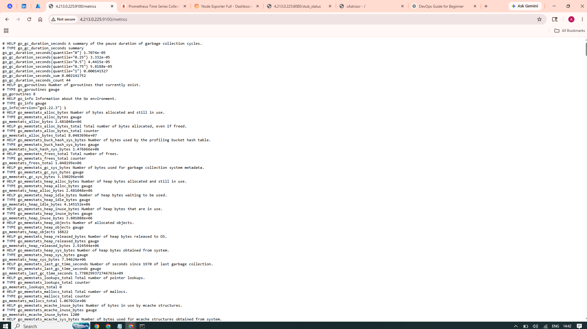
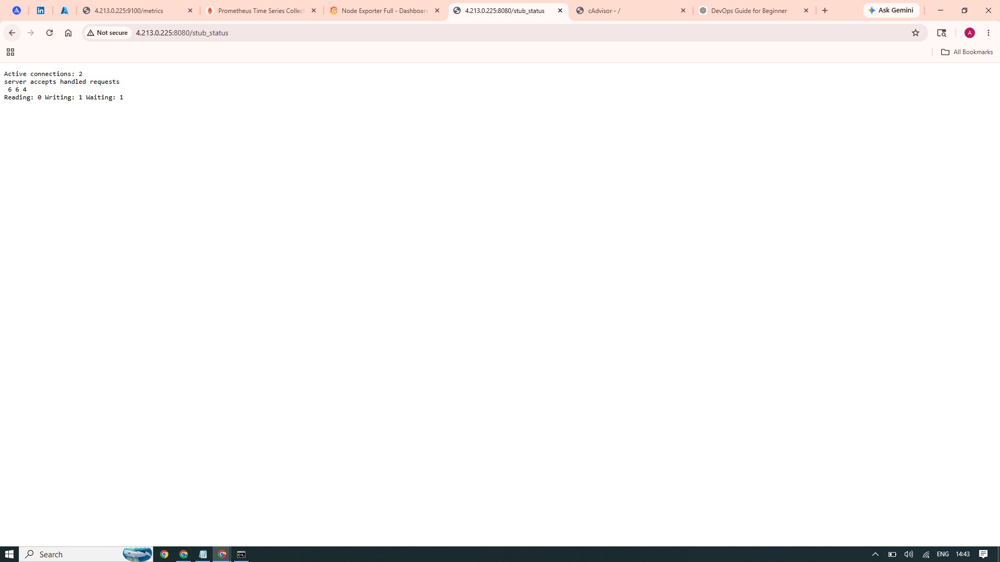
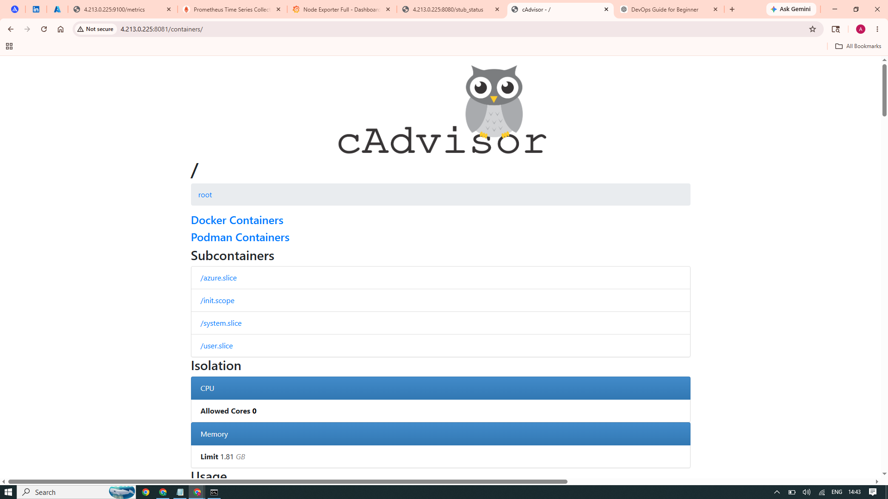

# 📊 Production-Grade DevOps Monitoring Stack


Production-grade monitoring and observability platform implementing infrastructure telemetry, Linux server visibility, container monitoring, dashboard analytics and operational monitoring workflows aligned with DevOps and SRE operational practices.

---

# 📌 Executive Summary

Designed and implemented enterprise monitoring platform using:

✅ Prometheus Metrics Collection

✅ Grafana Visualization

✅ Node Exporter Metrics Collection

✅ Container Monitoring using cAdvisor

✅ Linux Infrastructure Monitoring

✅ Dockerized Monitoring Platform

✅ Real-Time Infrastructure Visibility

✅ Dashboard Analytics

✅ Operational Observability

---

# 🎯 Business Requirement

Modern infrastructure environments require:

❌ Missing telemetry visibility

❌ Slow issue detection

❌ Manual infrastructure validation

❌ Missing operational dashboards

❌ Infrastructure blind spots

❌ Limited troubleshooting visibility

This project solves those challenges using open-source observability engineering principles.

---

# 🏗️ Architecture Design



---

# ✨ Features & Core Components

### 🚀 Automated Metrics Collection

Prometheus configured for automated metrics scraping.

Capabilities:

✅ Metrics Aggregation

✅ Infrastructure Visibility

✅ Time-Series Data Collection

✅ Continuous Monitoring

---

### 📈 Linux Infrastructure Monitoring

Collected Metrics:

✅ CPU Usage

✅ Memory Usage

✅ Disk Utilization

✅ Network Statistics

✅ Server Health

---

### 📊 Grafana Dashboard Analytics

Implemented:

✅ Dashboard Visualization

✅ Infrastructure Analytics

✅ Resource Visibility

✅ Performance Monitoring

---

### 🐳 Container Monitoring

Implemented:

✅ Container Visibility

✅ Container Resource Metrics

✅ Docker Infrastructure Monitoring

Using:

cAdvisor

---

# 🚨 Production Monitoring Threshold Visibility

Configured monitoring visibility for:

🔴 CPU Utilization

CPU > 85%

---

🔴 Memory Usage

Memory > 90%

---

🟡 Disk Usage

Disk > 80%

---

❌ Monitoring Service Failure

Exporter unavailable

---

# 🛠️ Prerequisites

Ensure dependencies are installed.

| Requirement | Details |
|-------------|----------|
| Docker | Installed |
| Docker Compose | Installed |
| Git | Installed |
| Linux Environment | Ubuntu Recommended |

Required Ports:

9090 → Prometheus

3000 → Grafana

9100 → Node Exporter

---

# ⚙️ Configuration Variables

Modify deployment behavior.

| Parameter | Description | Default |
|---|---|---|
| SCRAPE_INTERVAL | Metrics collection interval | 15s |
| GRAFANA_PORT | Grafana UI | 3000 |
| PROMETHEUS_PORT | Prometheus UI | 9090 |
| NODE_EXPORTER_PORT | Exporter Port | 9100 |

---

# ⚙️ Technology Stack

| Tool | Purpose |
|------|----------|
| Docker | Container Runtime |
| Docker Compose | Multi Container Deployment |
| Prometheus | Metrics Collection |
| Grafana | Dashboard Visualization |
| Node Exporter | Linux Metrics Collection |
| cAdvisor | Container Monitoring |
| Linux | Server Environment |

---

# 📂 Repository Structure

```bash

.

├── docker-compose.yml

├── prometheus/

│ └── prometheus.yml

├── grafana/

│ └── provisioning/

├── screenshots/

├── README.md

└── .gitignore

```

---

# 🚀 Deployment Workflow

Clone Repository:

```bash
git clone https://github.com/Akamitt009/devops-monitoring-stack.git

cd devops-monitoring-stack
```

Deploy Stack:

```bash
docker-compose up -d
```

Validate Services:

```bash
docker ps
```

Expected:

✅ Prometheus

✅ Grafana

✅ Node Exporter

---

# 🌐 Access Services

| Service | URL |
|---|---|
| Grafana | http://localhost:3000 |
| Prometheus | http://localhost:9090 |
| Node Exporter | http://localhost:9100/metrics |

---

# 🔥 Monitoring Flow



---

# 📸 Project Proof Screenshots

## Grafana Dashboard



---

## Prometheus Targets



---

## Node Exporter Metrics



---

## NGINX Monitoring



---

## Container Monitoring



---

# ⚠️ Engineering Challenges Solved

| Challenge | Solution |
|---|---|
| Missing Linux Metrics | Node Exporter |
| Container Visibility | cAdvisor |
| Dashboard Analytics | Grafana |
| Service Orchestration | Docker Compose |

---

# 📈 Future Improvements

Planned:

✅ Kubernetes Monitoring

✅ Production Cloud Deployment

✅ Blackbox Exporter

✅ SSL Reverse Proxy

---

# 🧠 Skills Demonstrated

Prometheus

Grafana

Docker

Docker Compose

Linux Administration

Infrastructure Monitoring

Container Monitoring

Metrics Collection

Observability Engineering

DevOps Operations

SRE Fundamentals

---

# 📈 Business Outcome

Successfully implemented enterprise monitoring platform supporting:

✅ Infrastructure Visibility

✅ Metrics Analytics

✅ Container Monitoring

✅ Dashboard Visualization

✅ Linux Monitoring

✅ Operational Visibility

---

# 👨‍💻 Author

## Amit Kumar

Cloud Engineer | DevOps Engineer | Observability Engineer

GitHub

https://github.com/Akamitt009

LinkedIn

https://www.linkedin.com/in/amit-kumar-657255232/
