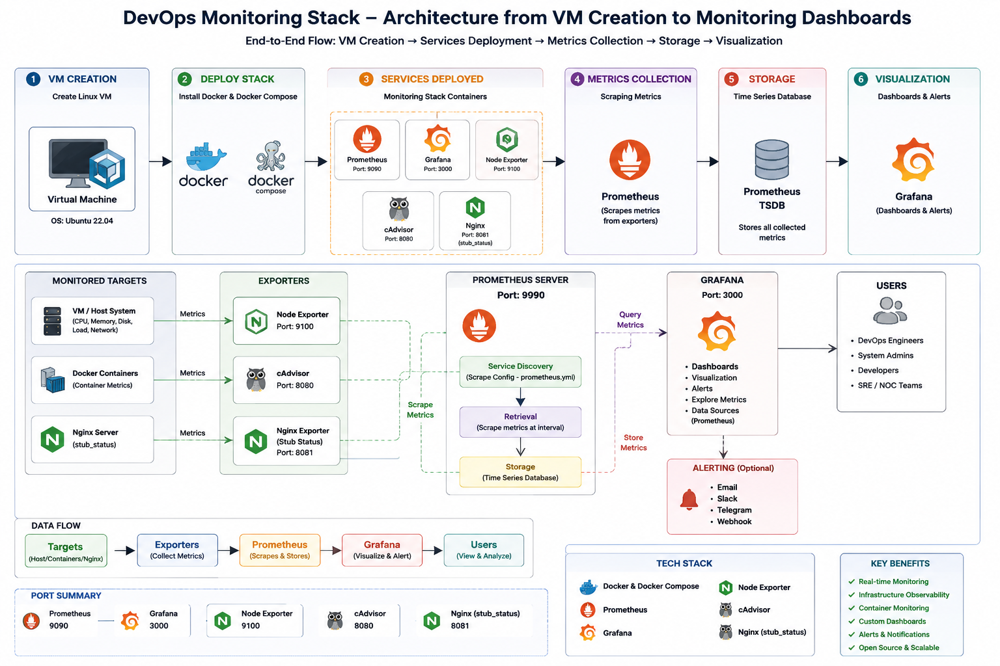

# DevOps Monitoring Stack

Production-ready DevOps monitoring stack using Prometheus, Grafana, Docker, and Node Exporter for real-time infrastructure monitoring, observability, and alerting.

---

# Project Overview

This project demonstrates a complete monitoring solution used in modern DevOps and cloud environments.

The stack collects system-level metrics such as:

* CPU Usage
* Memory Usage
* Disk Usage
* Network Statistics
* Server Health
* Container Monitoring

These metrics are collected using Node Exporter and visualized using Grafana dashboards.

---

# Architecture



---

# Tech Stack

| Tool           | Purpose                       |
| -------------- | ----------------------------- |
| Docker         | Containerization              |
| Docker Compose | Multi-container orchestration |
| Prometheus     | Metrics collection            |
| Grafana        | Visualization dashboards      |
| Node Exporter  | Linux metrics exporter        |
| Linux          | Server environment            |

---

# Features

* Real-time server monitoring
* Infrastructure observability
* Dockerized monitoring stack
* Grafana dashboard integration
* Prometheus metrics scraping
* CPU and Memory monitoring
* Disk and Network monitoring
* Easy deployment using Docker Compose
* Beginner-friendly DevOps architecture

---

# Folder Structure

```bash
.
├── docker-compose.yml
├── prometheus/
│   └── prometheus.yml
├── grafana/
│   └── provisioning/
├── screenshots/
│   ├── grafana-dashboard.png
│   ├── prometheus-targets.png
│   └── docker-containers.png
├── README.md
└── .gitignore
```

---

# Prerequisites

Before starting, ensure the following are installed:

* Docker
* Docker Compose
* Git

---

# Installation & Setup

## 1. Clone Repository

```bash
git clone https://github.com/Akamitt009/devops-monitoring-stack.git
cd devops-monitoring-stack
```

---

## 2. Start Monitoring Stack

```bash
docker-compose up -d
```

---

## 3. Verify Running Containers

```bash
docker ps
```

Expected containers:

* Prometheus
* Grafana
* Node Exporter

---

# Access Services

| Service       | URL                                                            |
| ------------- | -------------------------------------------------------------- |
| Grafana       | [http://localhost:3000](http://localhost:3000)                 |
| Prometheus    | [http://localhost:9090](http://localhost:9090)                 |
| Node Exporter | [http://localhost:9100/metrics](http://localhost:9100/metrics) |

---

# Default Grafana Login

```text
Username: admin
Password: admin
```

---

# Prometheus Configuration

Example configuration:

```yaml
global:
  scrape_interval: 15s

scrape_configs:
  - job_name: 'node-exporter'
    static_configs:
      - targets: ['node-exporter:9100']
```

---

# Docker Compose Configuration

```yaml
version: '3'

services:
  prometheus:
    image: prom/prometheus
    ports:
      - "9090:9090"

  grafana:
    image: grafana/grafana
    ports:
      - "3000:3000"

  node-exporter:
    image: prom/node-exporter
    ports:
      - "9100:9100"
```

---

# Monitoring Flow

```text
Linux Server Metrics
        ↓
Node Exporter
        ↓
Prometheus
        ↓
Grafana Dashboards
```

---

# Screenshots

## Grafana Dashboard


---

## Prometheus Targets


---

## Node Exporter Metrics


---

## Nginx Stub Status


---

## cAdvisor Container Monitoring


# Commands Cheat Sheet

## Start Services

```bash
docker-compose up -d
```

## Stop Services

```bash
docker-compose down
```

## Restart Services

```bash
docker-compose restart
```

## Check Logs

```bash
docker logs prometheus
```

---

# Future Improvements

Planned enhancements:

* Alertmanager integration
* Slack alert notifications
* Email alerting
* Loki log aggregation
* cAdvisor container monitoring
* Kubernetes monitoring
* Blackbox Exporter
* SSL and reverse proxy setup
* Production deployment on cloud VM

---

# Real-World Use Cases

This project can be used for:

* Infrastructure Monitoring
* DevOps Demonstrations
* NOC Monitoring
* Cloud Server Observability
* Docker Environment Monitoring
* Learning Prometheus & Grafana
* Interview Portfolio Projects

---

# Skills Demonstrated

* Docker
* Monitoring & Observability
* Prometheus
* Grafana
* Linux Administration
* Infrastructure Monitoring
* Metrics Collection
* DevOps Fundamentals

---

# Resume Project Description

Built a production-style monitoring stack using Prometheus, Grafana, Docker, and Node Exporter to monitor infrastructure metrics including CPU, memory, disk usage, and system health with real-time visualization dashboards.

---

# Author

Amit Kumar

GitHub:

[https://github.com/Akamitt009](https://github.com/Akamitt009)

---

# License

This project is licensed under the MIT License.

---

# Support

If you found this project useful:

* Star the repository
* Fork the project
* Connect on LinkedIn
* Share feedback

---

# DevOps Monitoring Stack

Modern infrastructure monitoring solution built using open-source DevOps tools.
